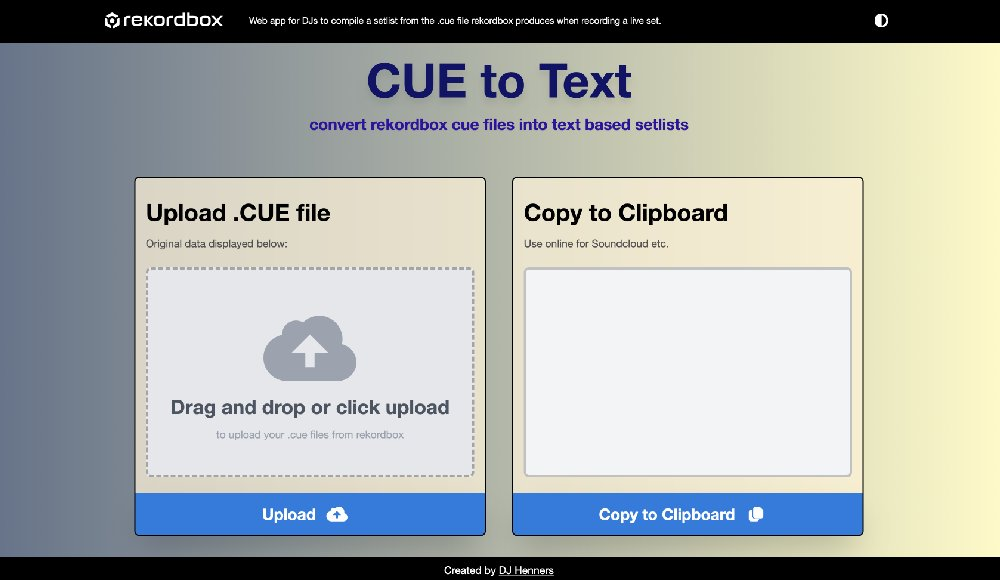

# Convert-Rekordbox-Cue-File-to-Setlist

## Web app to convert CUE files to a readable text setlist users can copy for their set uploads.

Got started with [Manish Mandal's](https://medium.com/how-to-react/how-to-parse-or-read-csv-files-in-reactjs-81e8ee4870b0) breakdown on [papaparse](https://react-papaparse.js.org/), which was a good starting point, to use the initial data.

Then big thanks to you [echomonk](https://github.com/echomonk)! Appreciate your time, encouragement and patience, whilst helping me break down this seemingly complex app, into simple step by step problems to solve.
